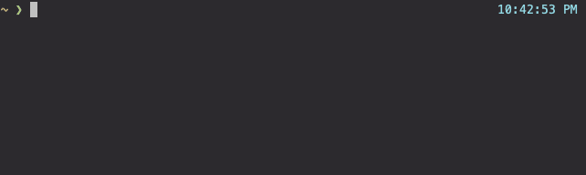

# slowlorust

<h4 align="center">Lightweight slowloris (HTTP DoS) implementation in Rust.</h4>
<p align="center">
  
</p>

> Slowloris is a denial-of-service attack program which allows an attacker to overwhelm a targeted server by opening and maintaining many simultaneous HTTP connections between the attacker and the target. 
-[Cloudflare](https://www.cloudflare.com/learning/ddos/ddos-attack-tools/slowloris/)

## Installation

Cargo

`cargo install slowlorust`

Manual

`cargo install --git https://github.com/MJVL/slowlorust`

## Usage

```
USAGE:
    slowlorust [OPTIONS] <IP> <PORT>

ARGS:
    <IP>      The IP address of the webserver
    <PORT>    The port the webserver is running on

OPTIONS:
    -b, --benchmark-delay <BENCHMARK_DELAY>
            How many seconds to wait between each connection benchmark [default: 15]

    -h, --header-count <HEADER_COUNT>
            How many headers to send before restarting a worker [default: 10]

        --help
            Print help information

    -l, --lower-sleep <LOWER_SLEEP>
            Lower bound of request delay in seconds [default: 0]

    -t, --timeout <TIMEOUT>
            How many seconds to wait before the server is "down" [default: 5]

    -u, --upper-sleep <UPPER_SLEEP>
            Upper bound of request delay in seconds [default: 15]

    -v, --verbose
            Log actions of each worker

    -V, --version
            Print version information

    -w, --worker-count <WORKER_COUNT>
            How many worker sockets to open [default: 50]
```